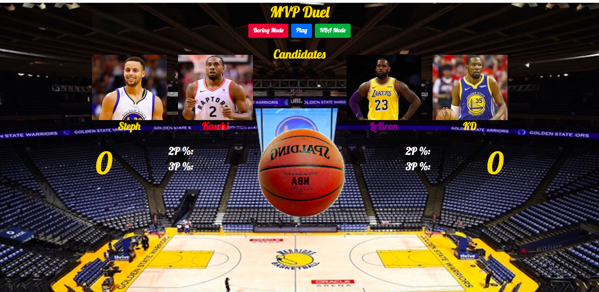

# NBA Duel Game
Interactive JQuery/Javascript game

## Project Description
A game that allows the user to toggle between two modes: a RPG battle per assignment specifications, 
and a more realistic NBA shootout where players randomly take either 2s or 3s, and then make them according to their actual shooting percentages. 

[The deployed version is accesible here](https://greysongy.github.io/unit-4-game/)

)

### Technologies Used

html, css, javascript, jquery, animate.css, bootstrap, Google Fonts

#### Additional Notes

Modes have to be selected at the beginning of the game, and attacks/shots (for either version) happen iteratively when you press the main
blue button

There is a strategic component in both versions (RPG wise-selecting opponents with lower counter attack, NBA-choosing players with superior percetages). There's still a large element of luck in the NBA mode, but you can improve your odds by selecting players with higher true-shooting percentages (which you'd have to derive).
